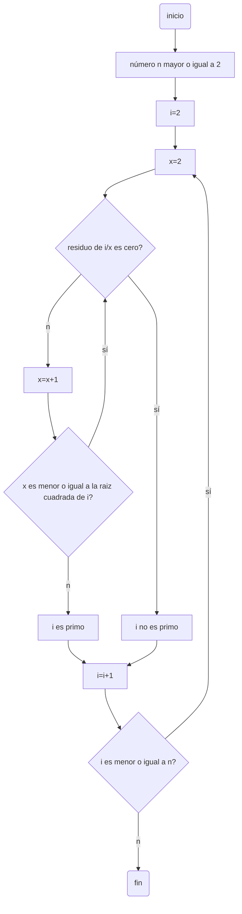

# Reto 3
**Instrucción**
1. Plantear el algoritmo para obtener los números primos hasta n, usando pseudocódigo y diagramas de flujo.

2. Revise el procedimiento matemático para hallar raíces cuadradas (son divisiones y restas), plantee el algoritmo en pseudocódigo y en diagrama de flujo.

3. Cree un repositorio en github en donde muestre el desarrollo de la actividad y comparta el enlace por el canal de slack reto_3

## Algoritmo para obtener los números primos

**Pseudocógigo**

```pseudocode
n : entero
i : entero
x : entero
inicio
  i := 2
  x := 2
  n :>=2
  Mientras i<=n hacer
    Si  (x<=(i**0.5)) entonces
      Si modulo(i,x) == 0 entonces
        escribir("i no es primo")
        i := i + 1
        x := 2
      Sino
        x := x + 1
    Sino entonces
      escribir "i es primo"
      i := i + 1
      x := 2
    Fin Si
  Fin mientras 
fin
```
**Diagrama de flujo**


